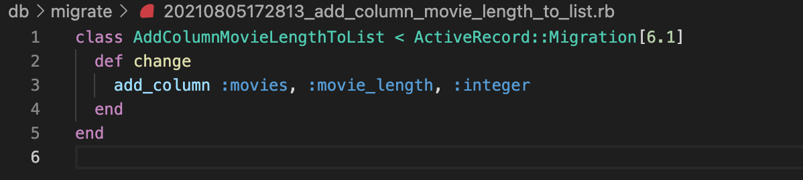
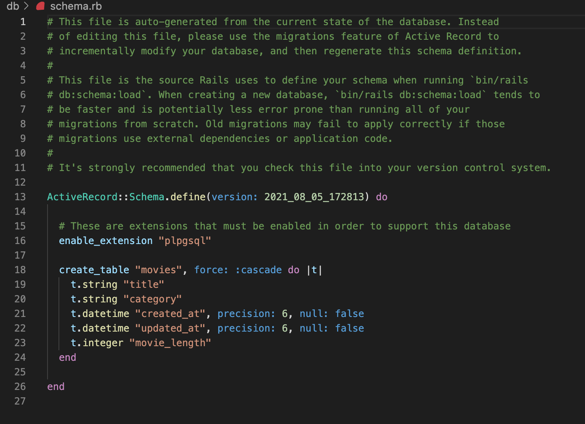
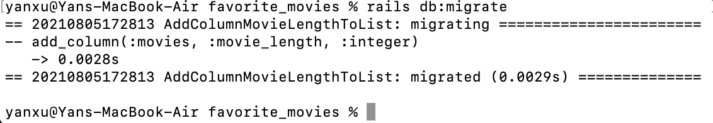
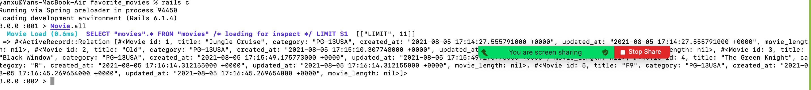
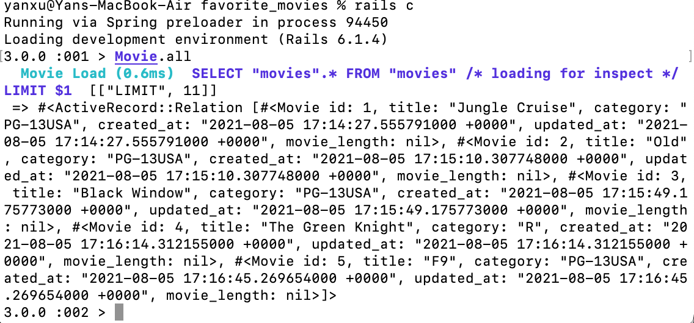
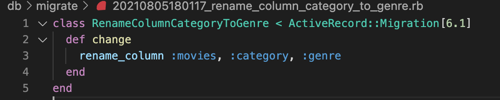
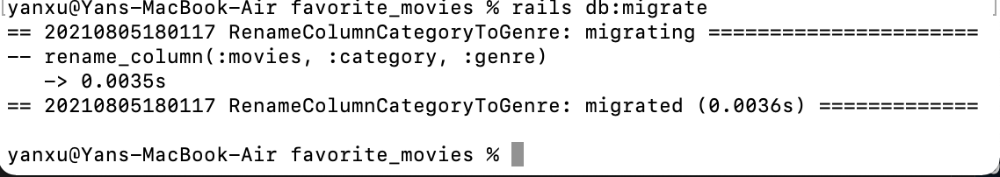
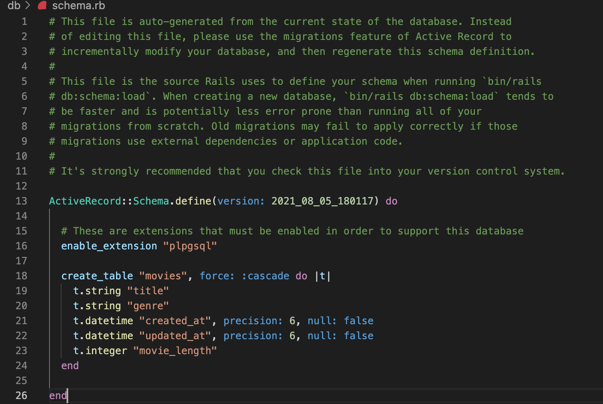

## Favorite Movies Challenge
### Setup
- Create a new Rails application called 'favorite_movies'.
- Create the database
- Generate a Movie model with a title attribute and a category attribute
```ruby
$ rails new favorite_movies -d postgresql -T
# Output: webpacker successfully installed
$ cd favorite_movies
# Check the created favorite_movies folder
$ rails db:create
# Output
# Created database 'favorite_movies_development'
# Created database 'favorite_movies_test'
$ rails server
# Booting Puma
# ...
# Use Ctrl-C to stop 
# Open browser and localhost will see the ruby on rail page
$ rails generate model Movie title:string category:string
$ rails db:migrate
# Check the created file：favorite_movies>app>models>movie.rb
$ rails c
# Open up Rails console.
```
### Challenges
- Add five entries to the database via the Rails console
```ruby
3.0.0 :001 > Movie.create title:"Jungle Cruise",category:"PG-13USA"
3.0.0 :002 > Movie.create title:"Old",category:"PG-13USA"
3.0.0 :003 > Movie.create title:"Black Window",category:"PG-13USA"
3.0.0 :004 > Movie.create title:"The Green Knight",category:"R"
3.0.0 :005 > Movie.create title:"F9",category:"PG-13USA"
```
- Create a migration to add a new column to the database called movie_length



- Update the values of the five existing attributes to include a movie_length value
```ruby
3.0.0 :002 > update = Movie.find 1
# Output:  
# Movie Load (0.3ms)  SELECT "movies".* FROM "movies" WHERE "movies"."id" = $1 LIMIT $2  [["id", 1], ["LIMIT", 1]]
#  => #<Movie id: 1, title: "Jungle Cruise", category: "PG-13USA", created_a... 
3.0.0 :003 > update.movie_length = 127
#  => 127 
3.0.0 :004 > update.save
# Caution here!!! SAVE the updates!!!
# After update all movies with movie_length, run: Moive.all check the updated information.
# Update other four existing rows 
```
- Generate a migration to rename the column 'category' to 'genre'
```ruby
yanxu@Yans-MacBook-Air favorite_movies % rails generate migration rename_column_category_to_genre
# Running via Spring preloader in process 94605
#       invoke  active_record
#       create    db/migrate/20210805180117_rename_column_category_to_genre.rb
# yanxu@Yans-MacBook-Air favorite_movies % 
```





